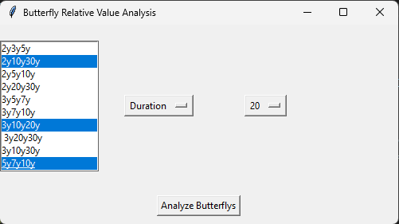
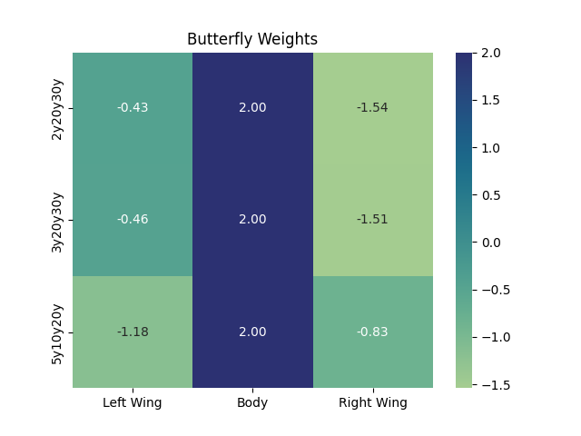
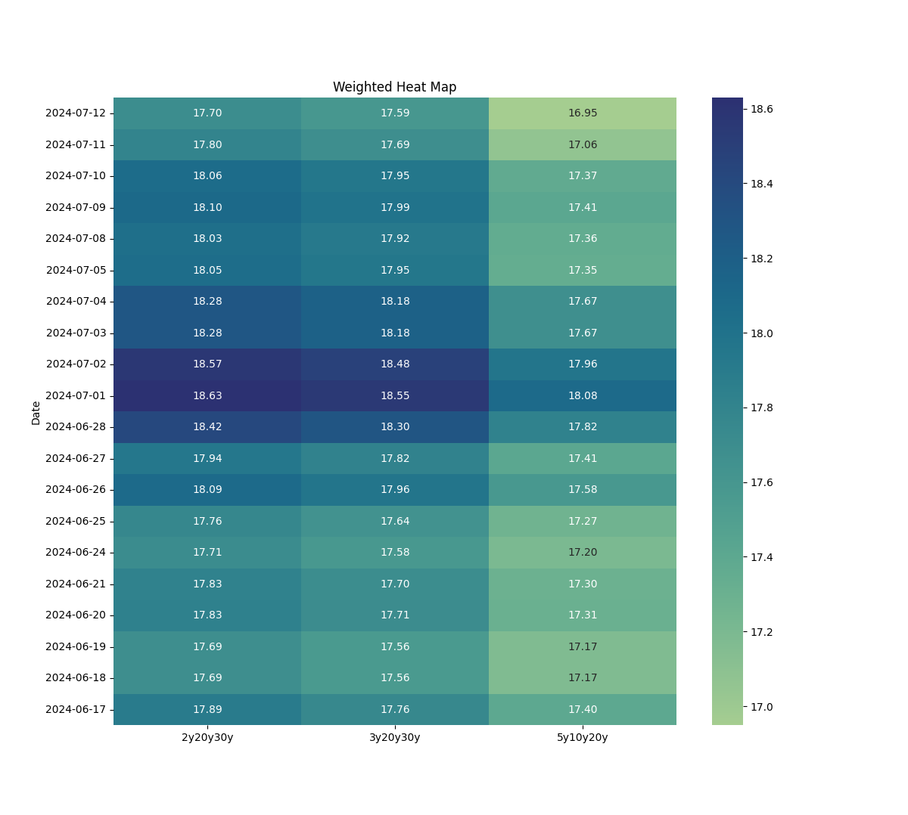

# Treasury Butterfly Analysis
This project is a simple tool that allows users to create time series data from a csv using data on bonds available from Treasury direct.
### Prerequisites
Ensure you have the following installed:
    - Python 3.13+
    - bond data from https://www.treasurydirect.gov/auctions/auction-query/
    - bond pricing data 

Setup steps (while not necessary to use python virtual env it is highly recomended)
1) have python installed locally on your machine.
2) create a virtual environment for this project using "python -m venv myenv"
3) activate the loval python virtual environment "myenv\Scripts\activate.bat" for windows and for Linux or MacOS "source myenv/bin/activate"
4) then do "pip install -r requirements.txt"
5) run "python butterflies.py"

Example of some reports

